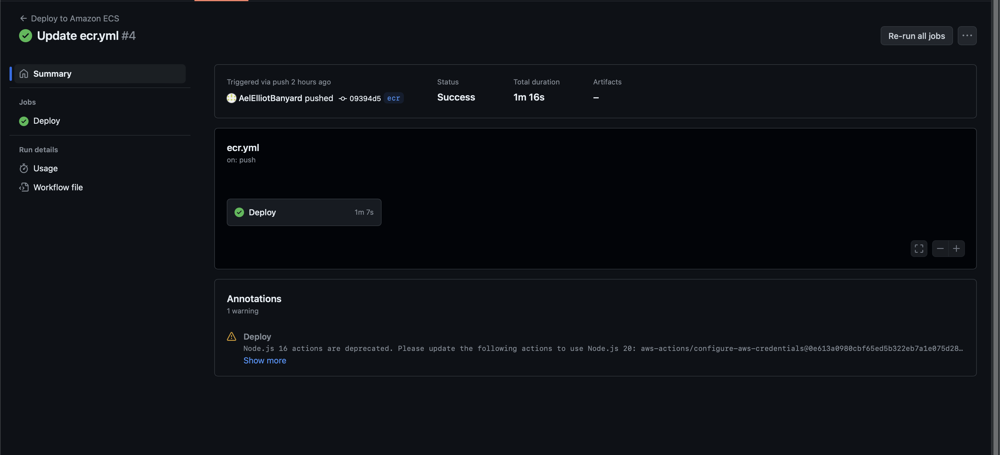

# Modul 324 Devops

## Augabe 1

Ich habe die Ref-card-02 in einen eigenen Branch kopiert. Zusätzlich habe ich einen Workflow definiert welcher bei einem gemergeden Pull-Request auf den Branch "dockerhub" läüft.
Dieser Workflow nimmt das Dockerfile, welchhes ich geschrieben habe, buildet es und pushed es auf Docker Hub.

Worflow:

```yaml
name: "Build and Push to Server"
on:
  pull_request:
    branches: [dockerhub]
    types:
      - closed

env:
  working-directroy: ./

jobs:
  if_merged:
    if: github.event.pull_request.merged == true
    runs-on: ubuntu-latest
    steps:
      - name: Check out the repo
        uses: actions/checkout@v4

      - name: Log in to Docker Hub
        uses: docker/login-action@f4ef78c080cd8ba55a85445d5b36e214a81df20a
        with:
          username: ${{ secrets.DOCKER_USERNAME }}
          password: ${{ secrets.DOCKER_PASSWORD }}

      - name: Extract metadata (tags, labels) for Docker
        id: meta
        uses: docker/metadata-action@9ec57ed1fcdbf14dcef7dfbe97b2010124a938b7
        with:
          images: aelelliotbanyardbbw/m324-devops

      - name: Build and push Docker image
        uses: docker/build-push-action@3b5e8027fcad23fda98b2e3ac259d8d67585f671
        with:
          context: .
          file: ./Dockerfile
          push: true
          tags: ${{ steps.meta.outputs.tags }}
          labels: ${{ steps.meta.outputs.labels }}
```

Dockerfile:

```
FROM node:latest
WORKDIR /
RUN git clone --single-branch --branch docker https://github.com/AelElliotBanyard/324_devops.git
WORKDIR /324_devops
EXPOSE 3000
ENTRYPOINT ["npm", "run", "start"]
```

Github Action Run:


Ablauf:
Ich habe das gitlab projekt ohne probleme auf meinen github account kopiert. Anschliessend habe ich einen neuen Branch erstellt und die Ref-card-02 in diesen Branch kopiert. Danach habe ich ein Dockerfile geschrieben und einen Workflow definiert welcher bei einem gemergeden Pull-Request auf den Branch "dockerhub" läüft. Dieser Workflow nimmt das Dockerfile, welchhes ich geschrieben habe, buildet es und pushed es auf Docker Hub.
Beim pushen auf Docker Hub hatte ich einige Probleme, aber dies lag daran, dass ich den Workflow nicht richtig definiert hatte. Nachdem ich dies korrigiert hatte, funktionierte es einwandfrei.

## Augabe 2

Bei der Aufgabe 2 hatte ich erstmals ein Problem mit GitHub Registry Container. Ich habe den Workflow so definiert, dass er das Dockerfile buildet und auf GitHub Container Registry pusht. Dies hat jedoch nicht funktioniert. Ich hatte vergessen, die nötigen Berechtigungen zu erteilen. Nachdem ich dies gemacht hatte, funktionierte es einwandfrei.

Workflow:

```yaml
name: "Build and Push to GHCR"
on:
  push:
    branches:
      - ghcr

env:
  working-directroy: ./

jobs:
  GHCR:
    runs-on: ubuntu-latest
    permissions:
      contents: read
      packages: write
    steps:
      - name: Check out the repo
        uses: actions/checkout@v4

      - name: "Login to GitHub Container Registry"
        uses: docker/login-action@v1
        with:
          registry: ghcr.io
          username: ${{github.actor}}
          password: ${{secrets.GITHUB_TOKEN}}

      - name: "Build Inventory Image"
        run: |
          docker build . --tag ghcr.io/aelelliotbanyard/store:latest
          docker push ghcr.io/aelelliotbanyard/store:latest
```

Das Dockerfile ist das gleiche wie in der Aufgabe 1.

GitHub Action Run:


## Aufgabe ECR

1. Befehl in der AWS CLI um ein ECR Repository zu erstellen:

```bash
aws ecr create-repository \
    --repository-name m324devopsbanyard \
    --region us-east-1

```

2. AWS Access Key, Secret Key und Session Token als Secrets in GitHub hinterlegen
3. Workflow erstellen, welcher das Dockerfile auf das ECR Repository pusht

```yaml
name: Deploy to Amazon ECS

on:
  push:
    branches:
      - ecr

env:
  AWS_REGION: us-east-1
  ECR_REPOSITORY: m324devopsbanyard

jobs:
  deploy:
    name: Deploy
    runs-on: ubuntu-latest
    environment: production

    steps:
      - name: Checkout
        uses: actions/checkout@v4

      - name: Configure AWS credentials
        uses: aws-actions/configure-aws-credentials@0e613a0980cbf65ed5b322eb7a1e075d28913a83
        with:
          aws-access-key-id: ${{ secrets.AWS_ACCESS_KEY_ID }}
          aws-secret-access-key: ${{ secrets.AWS_SECRET_ACCESS_KEY }}
          aws-region: ${{ env.AWS_REGION }}

      - name: Login to Amazon ECR
        id: login-ecr
        uses: aws-actions/amazon-ecr-login@62f4f872db3836360b72999f4b87f1ff13310f3a

      - name: Build, tag, and push image to Amazon ECR
        id: build-image
        env:
          ECR_REGISTRY: ${{ steps.login-ecr.outputs.registry }}
          IMAGE_TAG: ${{ github.sha }}
        run: |
          docker build -t $ECR_REGISTRY/$ECR_REPOSITORY:$IMAGE_TAG .
          docker push $ECR_REGISTRY/$ECR_REPOSITORY:$IMAGE_TAG
          echo "image=$ECR_REGISTRY/$ECR_REPOSITORY:$IMAGE_TAG" >> $GITHUB_OUTPUT
```

GitHub Action Run:


## Aufgabe ECS

1. Taskdefinition erstellt
   
2. Cluster erstellt
   
3. Service erstellt
   
   
   

Workflow:

```yaml
name: Deploy to Amazon ECS

on:
  push:
    branches:
      - ecs

env:
  AWS_REGION: us-east-1
  ECR_REPOSITORY: m324devopsbanyard
  ECS_SERVICE: m324-devops-banyard-service
  ECS_CLUSTER: m324devops-banyard
  ECS_TASK_DEFINITION: m324-devops-banyard
  CONTAINER_NAME: m324devopsbanyard

jobs:
  deploy:
    name: Deploy
    runs-on: ubuntu-latest
    environment: production

    steps:
      - name: Checkout
        uses: actions/checkout@v4

      - name: Configure AWS credentials
        uses: aws-actions/configure-aws-credentials@0e613a0980cbf65ed5b322eb7a1e075d28913a83
        with:
          aws-access-key-id: ${{ secrets.AWS_ACCESS_KEY_ID }}
          aws-secret-access-key: ${{ secrets.AWS_SECRET_ACCESS_KEY }}
          aws-session-token: ${{ secrets.AWS_SESSION_TOKEN }}
          aws-region: ${{ env.AWS_REGION }}

      - name: Login to Amazon ECR
        id: login-ecr
        uses: aws-actions/amazon-ecr-login@62f4f872db3836360b72999f4b87f1ff13310f3a

      - name: Build, tag, and push image to Amazon ECR
        id: build-image
        env:
          ECR_REGISTRY: ${{ steps.login-ecr.outputs.registry }}
          IMAGE_TAG: ${{ github.sha }}
        run: |
          docker build -t $ECR_REGISTRY/$ECR_REPOSITORY:$IMAGE_TAG .
          docker push $ECR_REGISTRY/$ECR_REPOSITORY:$IMAGE_TAG
          echo "image=$ECR_REGISTRY/$ECR_REPOSITORY:$IMAGE_TAG" >> $GITHUB_OUTPUT

      - name: Download task definition
        env:
          AWS_ACCESS_KEY_ID: ${{ secrets.AWS_ACCESS_KEY_ID }}
          AWS_SECRET_ACCESS_KEY: ${{ secrets.AWS_SECRET_ACCESS_KEY }}
          AWS_REGION: ${{ env.AWS_REGION }}
          AWS_SESSION_TOKEN: ${{ secrets.AWS_SESSION_TOKEN }}
        run: |
          aws ecs describe-task-definition --region ${{ env.AWS_REGION }} --task-definition ${{ env.ECS_TASK_DEFINITION }} \
          --query taskDefinition > task-definition.json

      - name: Fill in the new image ID in the Amazon ECS task definition
        id: task-def
        uses: aws-actions/amazon-ecs-render-task-definition@c804dfbdd57f713b6c079302a4c01db7017a36fc
        with:
          task-definition: task-definition.json
          container-name: ${{ env.CONTAINER_NAME }}
          image: ${{ steps.build-image.outputs.image }}

      - name: Deploy Amazon ECS task definition
        uses: aws-actions/amazon-ecs-deploy-task-definition@df9643053eda01f169e64a0e60233aacca83799a
        with:
          task-definition: ${{ steps.task-def.outputs.task-definition }}
          service: ${{ env.ECS_SERVICE }}
          cluster: ${{ env.ECS_CLUSTER }}
          wait-for-service-stability: true
```

GitHub Action Run:

